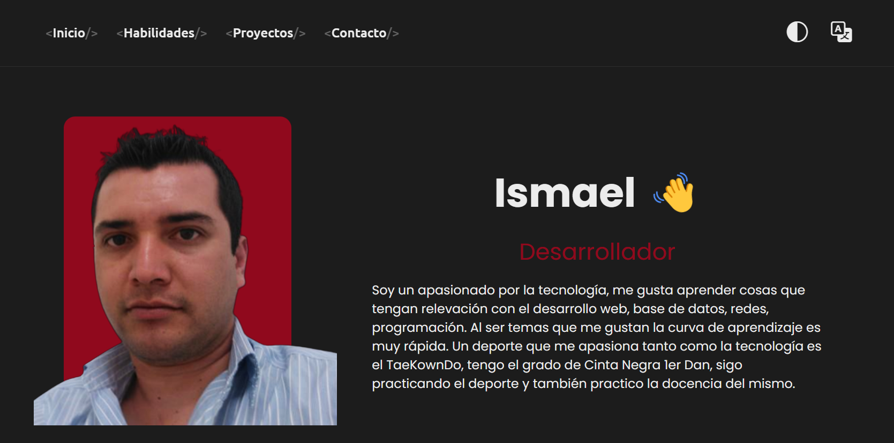

# Ismael Vargas Martinez

## Table of contents

- [Overview](#overview)
  - [The challenge](#the-challenge)
  - [Screenshot](#screenshot)
  - [Links](#links)
- [My process](#my-process)
  - [Built with](#built-with)
- [Author](#author)

## Overview
This page is to show some of my projects, I used Html, Css, Js and React+Vite to build the site.

### Screenshot

### Links

- Solution URL: [https://github.com/ivargasm/ismaelvm](https://github.com/ivargasm/ismaelvm)
- Live Site URL: [https://ismaelvm.xyz/](https://ismaelvm.xyz/)

## My process

First generate the layout with HTML and CSS and then export it to React + Vite to add the dynamic part.

### Built with

- Semantic HTML5 markup
- CSS custom properties
- Flexbox
- CSS Grid
- Mobile-first workflow
- [React](https://reactjs.org/) - JS library
- [Vite](https://vitejs.dev/) - JS

## Author

- Website - [Ismael Vargas Martinez](https://ivargasm.com)
